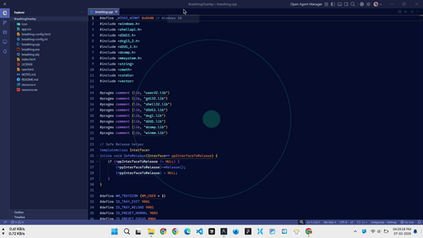
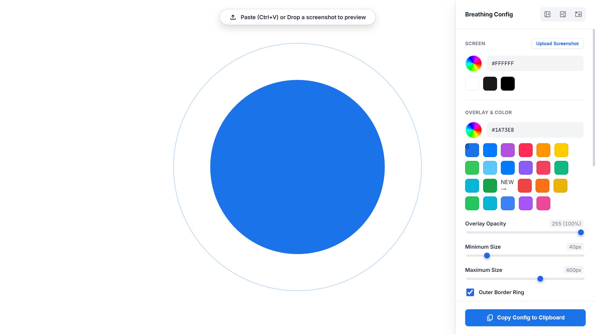

# **Breathing Overlay (Native Windows)**

A tiny, "Zero-Dependency" breathing exercise overlay for Windows.

**❤️ For Wellbeing, Nothing else:**

This project is a personal tool built for mental health and focus. It is completely free, open-source, and not intended for sale or commercial use. I built it to help myself, and I'm sharing it to help you.




## **The Story**

I was searching for a simple overlay app that stays **Always-on-Top** to help me fix my breathing while using my laptop.

My inspiration was [**Exhale**](https://github.com/peterklingelhofer/exhale).

- The original **macOS version** (built in **Swift**) is fantastic—it is incredibly small, resource-friendly, and smooth.  
- However, the **Windows/Linux port** was built using **Electron**.

I realized the file size of windows and linux was **over 600MB** and it consumed significant RAM (~100MB) just to render a moving circle.

I wanted the efficiency of the original Swift app, but on Windows.

But **I am a web developer.** I have zero experience making native Windows apps. So, I vibe coded **Breathing** using **Gemini Deep Research** and **Antigravity** (Gemini 3 Pro). I tried keeping the app size as low as possible

**The Result:**

- **Size:** 250KB (\~150KB exe and 100KB icons).  
- **Performance:** Uses almost 0% CPU, 5-10% GPU and <10MB RAM.  
- **Tech:** Native C++ using Windows **DirectComposition**.

## **✨ Features**

- **Ghost Mode:** The window is "click-through". You can keep working/typing while the breathing guide floats above your work.  
- **System Tray:** Right-click the icon to switch presets (Normal, Focus, Quick) or toggle the border ring.  
- **Auto-Config:** The app automatically generates a `config.ini` file if you don't have one.

## **🎨 Visual Config Generator**

Since I'm a web dev, I didn't want to manually edit text files to change colors.

I included a file named breathing-config.html ([live](https://nitin2953.github.io/breathing/breathing-config.html)) in this repository.

1. Open breathing-config.html ([live](https://nitin2953.github.io/breathing/breathing-config.html)) in your browser.  
2. Optional: **Drag & Drop** a screenshot of your desktop/working app into the page.  
3. Visually adjust the size, colors, and timings.  
4. Click **"Copy Config"** and paste it into your config.ini file.

## **🤓 Under the Hood (For Developers)**

### **1\. No Browser Engine**

Electron apps bundle **Chromium** and **Node.js**. This app is written in **Raw C++**. It speaks directly to the Windows OS without any middleman.

### **2\. The "Secret Sauce": DirectComposition**

Most old Windows apps use **GDI**, which is slow for transparency. This app uses **DirectComposition (dcomp.lib)**.

- **Direct2D:** Draws the high-quality anti-aliased circle on the GPU.  
- **DirectComposition:** Composites that circle onto your screen. It handles the transparency natively at the hardware level.

### **3\. High-Precision Timing**

Uses QueryPerformanceCounter (Hardware Timer) to calculate Delta Time, ensuring the breathing animation is mathematically perfect regardless of computer speed.

## **📥 Installation**

### **Option 1: Download**

Go to the [**Releases**](https://github.com/nitin2953/breathing/releases) page and download breathing.exe. Just run it.

### **Option 2: Build it yourself**

I used **Visual Studio Build Tools 2022 LTSC -> "Desktop development with C++"**.

1. Open **Developer Command Prompt for VS 2022**.  
2. Run:
  ```
  rc resource.rc
  
  cl /std:c++17 /EHsc /O2 main.cpp resource.res user32.lib gdi32.lib shell32.lib d3d11.lib dxgi.lib d2d1.lib dcomp.lib winmm.lib /link /SUBSYSTEM:WINDOWS /OUT:breathing.exe
  ```
## **⚠️ Note**

This project is "Perfect" for my specific needs. **I do not have time to update, maintain, or add new features.** I am sharing it as-is.

However, if you have ideas or know C++ better than I do, feel free to send a **Pull Request**.

*Readme generated via AI, built with curiosity.*
